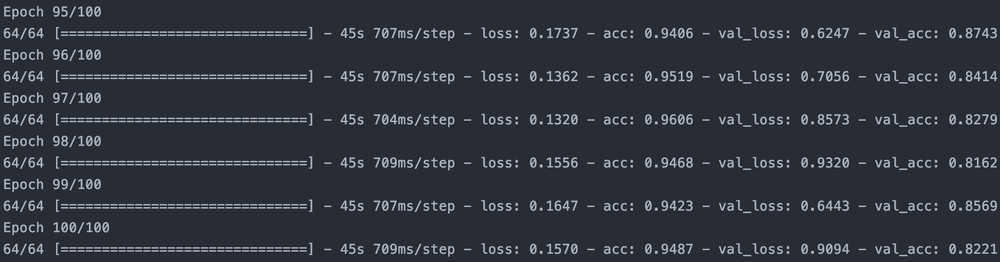

# 카카오프렌즈 이미지 분류
합성곱 신경망으로 9개 클래스의 이미지를 카메라를 통해 실시간으로 분류하는 iOS 애플리케이션

## 개발환경
* Python 3.7 (Anaconda)
* Xcode 11 (Swift 5.0, iOS 13)

## 데이터셋 수집
[참고](https://www.pyimagesearch.com/2018/04/09/how-to-quickly-build-a-deep-learning-image-dataset/)  
1. Microsoft Azure의 Cognitive Services에서 제공하는 Bing Image Search API 사용
2. (데이터가 부족해서) [AutoCrawler](https://github.com/YoongiKim/AutoCrawler)를 사용해 Google에서 이미지 수집
3. 카카오프렌즈 이미지가 아닌 사진(배경)을 구분하기 위해 [Flickr Image Dataset](https://www.kaggle.com/hsankesara/flickr-image-dataset)에서 이미지 300장 수집

> 총 2,592장

## 신경망 훈련
[참고](https://www.pyimagesearch.com/2018/04/16/keras-and-convolutional-neural-networks-cnns/)  
  
> 결과: 훈련 정확도 94%, 검증 정확도 82%

## 앱 빌드
[참고](https://www.pyimagesearch.com/2018/04/23/running-keras-models-on-ios-with-coreml/)  

## 저작권
캐릭터에 대한 모든 저작권은 카카오©에 있습니다. 학습용으로 사용하였습니다.